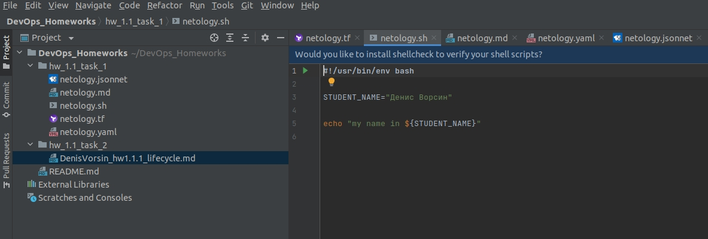
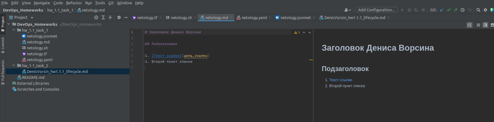
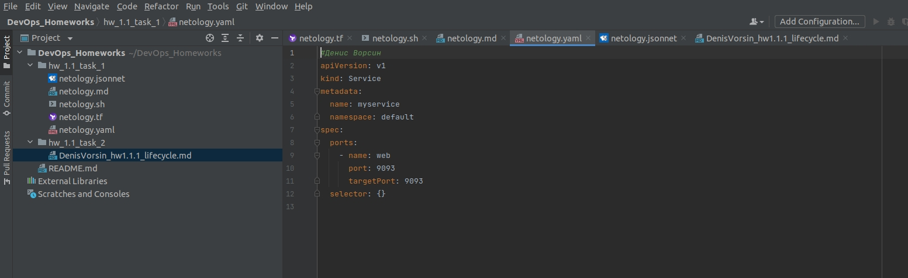
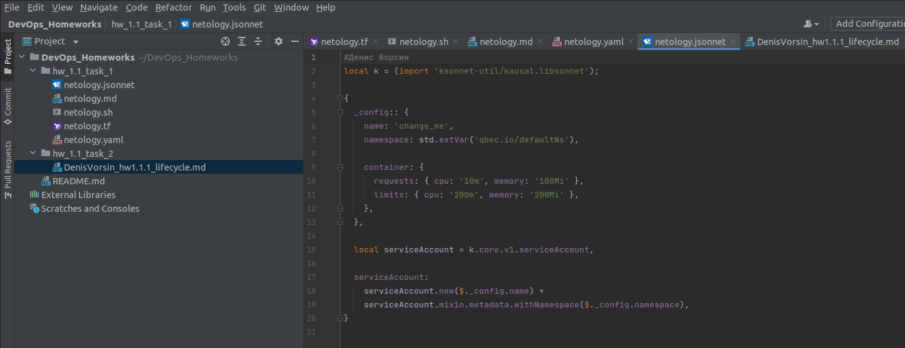

# Задание 1, Ссылки на скриншоты:
- 
- 
- 
- 
- 

# Задание 2, описание бизнес-процесса.

допустим, у менеджера есть ТЗ на необходимый функционал.

1. С участием менеджера, разработчика, тестировщика и девопса определяем что нам нужно для успешного решения:
1.1 определяем требования для тестовой среды в которой будет вестись разработка
1.2 определяем требования для тестовой среды в которой будет проходить первичное тестирование и демонстрация заказчику
1.3 определяем требования для продуктовой среды, где наше решение в итоге будет работать.
1.4 определяем основные этапы и сроки.
2. ДевОпс создает среду для разработчиков
2.1 Девопс с разработчиками согласовывает необходимое ПО.
2.2 Девопс устанавливает ПО, настраивает сбор логов, настраивает права доступа к среде, настраивает механизм контроля версий
2.3 Девопс организует процесс выпуска

Описание жизненного цикла разработки приложения:
ТЗ,
1. формулирование первичных требований к тестовой среде и прод среде
2. создание тестовой среды,
3. первичные тесты разрабочиками, работа в песочнице
4. сдача в тестирование в тестовой среде, запуск автотестов
5. сдача тестовой среды менеджером, согласование на выкатку в предпрод
6. согласование с заказчиком
7. запуск проекта с минимальной нагрузкой
8. приемо-сдаточные испытания
9. запуск в прод.
