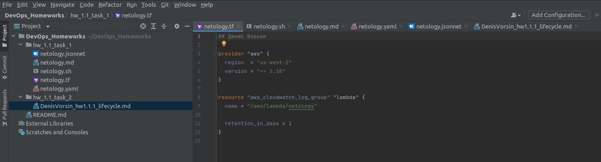

# Задание 1, скриншоты:
- 
- 
- 
- 
- 

# Задание 2, Описание жизненного цикла задачи.

Описание жизненного цикла разработки приложения:

согласно вебинару шаги создания приложения состоят из:
- разработка
- тестирование
- создание песочницы, выкладка на стейдж
- выкладка в продакшн
- мониторинг

1. Перед началом проекта менеджер определяет скоуп задач, задачи описываются в некоем ПО для управления проектами. определяются сроки и приоритеты.
2. В начале проекта разработчики и девопс договариваются в какой среде будет вестись разработка и какое серверное ПО требуется.
   1. Девопс настраивает необходимую среду с разграничением прав доступа, куда разработчики выкладывают код.
   2. Девопс создает серверное окружение для исполнения кода с минимальными выделенными ресурсами - песочница.
3. Среда разработки должна поддерживать версионность, должна прослеживаться история изменений.
   1. Каждый разработчик работает в своей независимой ветке,
   2. перенос кода в основную ветку контролирует старший разработчик или девопс.
   3. в случае выявления проблем среда разработка должна позволить откатить изменения.
4. при необходимости разработчик имеет возможность запустить код в персональной песочнице,
   1. девопс подготавливает пайплайн
   2. при старте теста создается копия песочницы, где исполняется код
   3. согласно пайплайну код проходит необходимые автотесты
   4. после завершения теста песочница автоматически удаляется
5. После завершения разработки происходит выкладка на стейдж
   1. девопс создает копию продакшн среды, в изолированном серверном окружении для исключения влияния на продакшн.
   2. в стейдж среде настроен сбор статистики с серверов и сбор логов компонент
   3. тестировщик подготавливает план тестирования ПО. План включает в себя все возможные сбои, ошибки в настройке компонент, отказы оборудования.
   4. Согласно плану проводится тестирование ПО, собирается статистика и логи ошибок в различных ситуациях.
   5. По выявленным ошибкам дорабатывается система мониторинга и уведомления продакшна.
6. после успешного прохождения тестов составляется пайплайн внедрения изменений в продакшн среду
   1. по возможности - Внедрение проводится поэтапно, обновляется сначала часть компонент
   2. при выкатке обновлений оценивается влияние обновлений, скорость обработки запросов, наличие ошибок
   3. в случае выявления проблем производится откат изменений.
   4. в случае если всё штатно - производится обновления остальных компонент.
7. После успешной выкатки обновлений в продакшн Менеджер радует клиентов новыми фичами.